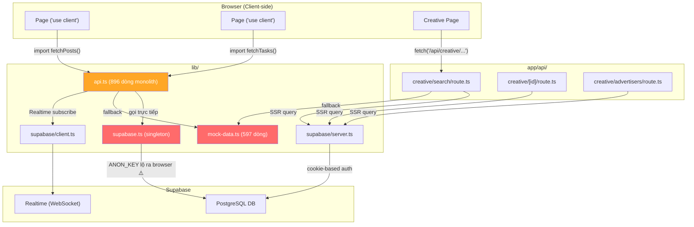
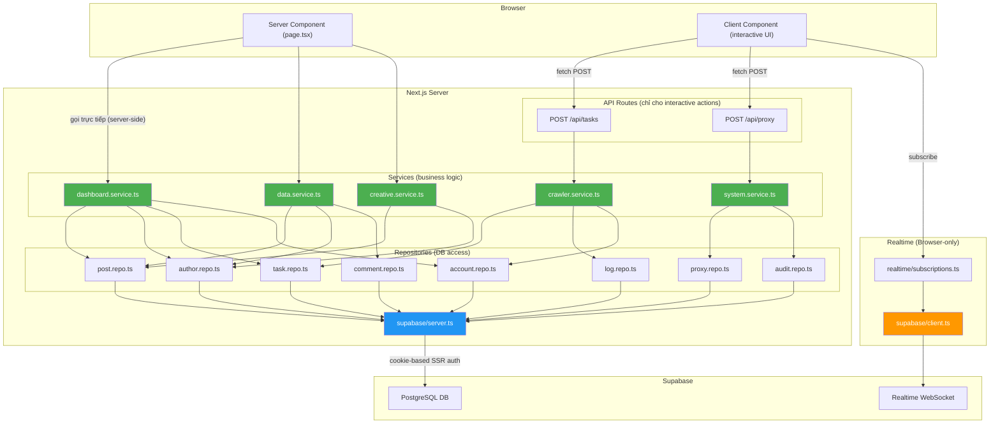
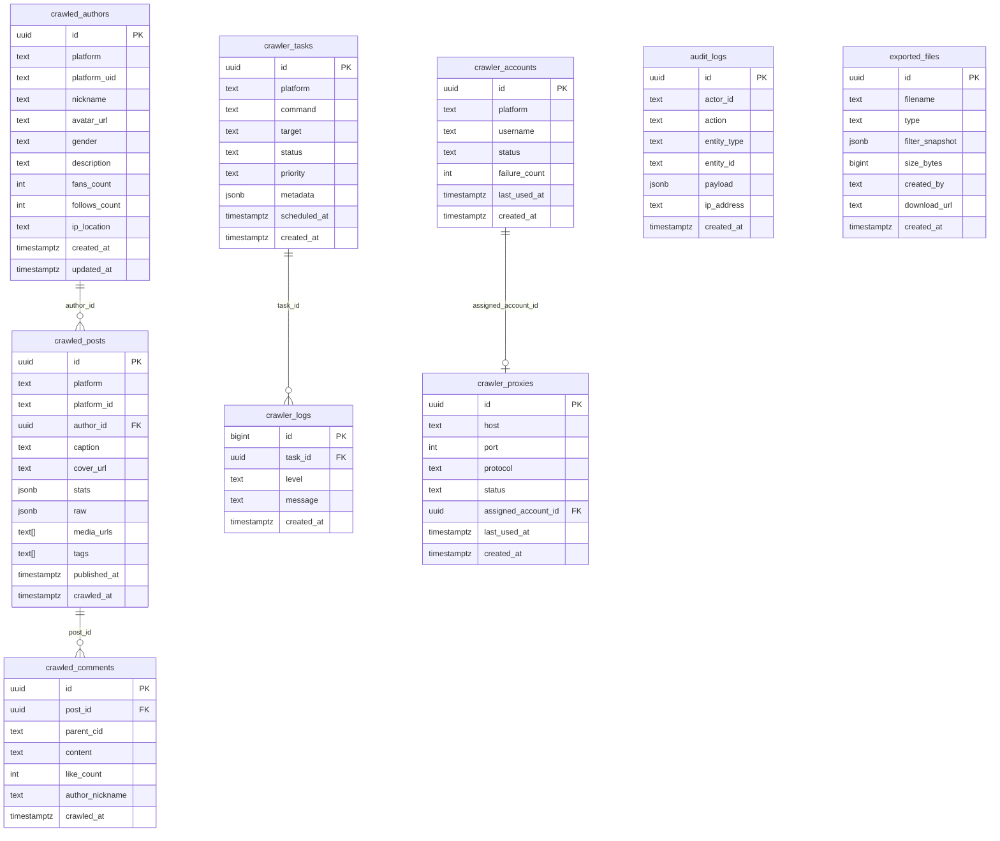

# 🏗️ Architecture — Frontend Dashboard ↔ Supabase

## 1. Tổng quan kết nối

Dashboard (Next.js 16) giao tiếp với Supabase qua **2 giao thức**:

| Giao thức | Dùng cho | Client |
|-----------|----------|--------|
| **PostgREST HTTP** | CRUD data (đọc/ghi bảng) | `@supabase/ssr` → `createServerClient()` |
| **WebSocket Realtime** | Lắng nghe thay đổi data live | `@supabase/ssr` → `createBrowserClient()` |

---

## 2. Kiến trúc CŨ (trước refactor) — ❌ Hỗn loạn



**Vấn đề chính:**
- `api.ts` gọi `supabase.ts` singleton → **ANON_KEY lộ ra browser**
- 3 Supabase client cùng tồn tại, page nào dùng cái nào là tuỳ hứng
- Lỗi DB → fallback mock → **che giấu lỗi thật**
- Không có tầng trung gian → page coupling trực tiếp với DB schema

---

## 3. Kiến trúc MỚI (đang refactor) — ✅ Repository + Service Layer



---

## 4. Luồng Request chi tiết

### 4.1 Đọc data (Server Component — không lộ key)

```
Browser GET /dash/home
  → Next.js render Server Component (page.tsx)
    → gọi getDashboardMetrics() [dashboard.service.ts]
      → tạo db = createClientServer() [supabase/server.ts — đọc cookies]
      → new PostRepository(db).count()
        → db.from("crawled_posts").select("id", { count: "exact", head: true })
          → HTTP POST https://127.0.0.1:54321/rest/v1/crawled_posts
            Headers: { apikey: ANON_KEY, Authorization: Bearer <JWT từ cookie> }
          ← { count: 140 }
      → new AuthorRepository(db).count() [song song]
      → new TaskRepository(db).findAllWithStatus() [song song]
      → new AccountRepository(db).findAll() [song song]
    ← { totalPosts: 140, totalAuthors: 16, runningTasks: 0, ... }
  → render HTML với data → trả về browser
```

### 4.2 Ghi data (Client Component → API Route → Service)

```
Browser: User bấm "Tạo Task"
  → Client Component POST /api/tasks { platform: "douyin", command: "search", target: "美妆" }
    → API Route handler
      → gọi createTask() [crawler.service.ts]
        → tạo db = createClientServer()
        → new TaskRepository(db).create({ ... })
          → db.from("crawler_tasks").insert([...]).select().single()
          ← { id: "uuid-xxx", status: "pending", ... }
    ← JSON response → Client Component cập nhật UI
```

### 4.3 Realtime (Browser WebSocket — file duy nhất dùng browser client)

```
Browser: Trang Tasks mount
  → import { subscribeToTasks } from "lib/realtime/subscriptions"
    → createClientBrowser() [supabase/client.ts — ANON_KEY ở browser, CHỈ cho Realtime]
    → supabase.channel("tasks-realtime")
      .on("postgres_changes", { event: "UPDATE", table: "crawler_tasks" }, callback)
      .subscribe()
    → WebSocket wss://127.0.0.1:54321/realtime/v1/websocket
  
  Khi crawler-pipeline cập nhật task status:
    ← WebSocket message: { new: { id: "uuid-xxx", status: "running" } }
    → callback(task) → UI re-render không cần refresh
```

---

## 5. Mapping: Page → Service → Repository → DB Table

| Trang Dashboard | Service | Repository | Bảng Supabase |
|-----------------|---------|------------|---------------|
| `/dash/home` | `dashboard.service` | `post.repo` `author.repo` `task.repo` `account.repo` | `crawled_posts` `crawled_authors` `crawler_tasks` `crawler_accounts` |
| `/dash/data/posts` | `data.service` | `post.repo` | `crawled_posts` |
| `/dash/data/authors` | `data.service` | `author.repo` | `crawled_authors` |
| `/dash/data/management` | `data.service` | `post.repo` | `crawled_posts` |
| `/dash/creative/search` | `creative.service` | `post.repo` `author.repo` | `crawled_posts` `crawled_authors` |
| `/dash/creative/trending` | `creative.service` | `post.repo` | `crawled_posts` |
| `/dash/creative/new` | `creative.service` | `post.repo` | `crawled_posts` |
| `/dash/creative/growth` | `creative.service` | `post.repo` | `crawled_posts` |
| `/dash/creative/advertisers` | `creative.service` | `author.repo` `post.repo` | `crawled_authors` `crawled_posts` |
| `/dash/creative/[id]` | `creative.service` | `post.repo` `author.repo` | `crawled_posts` `crawled_authors` |
| `/dash/tasks` | `crawler.service` | `task.repo` `log.repo` | `crawler_tasks` `crawler_logs` |
| `/dash/accounts` | `crawler.service` | `account.repo` | `crawler_accounts` |
| `/dash/proxies` | `system.service` | `proxy.repo` | `crawler_proxies` `crawler_accounts` |
| `/dash/audit-logs` | `system.service` | `audit.repo` | `audit_logs` |
| `/dash/settings` | `system.service` | — | `localStorage` |

---

## 6. Supabase Client — Ai dùng cái nào

| File | Loại | Chạy ở đâu | Ai import |
|------|------|-------------|-----------|
| `lib/supabase/server.ts` | `createServerClient()` từ `@supabase/ssr` | **Server only** (Server Components, API Routes) | Tất cả Services (qua Repository constructor) |
| `lib/supabase/client.ts` | `createBrowserClient()` từ `@supabase/ssr` | **Browser only** | **DUY NHẤT** `lib/realtime/subscriptions.ts` |
| `lib/supabase/middleware.ts` | Refresh session cookie | **Middleware** (edge) | `middleware.ts` |

> [!IMPORTANT]
> **ANON_KEY** chỉ lộ ra browser qua `supabase/client.ts` — và file duy nhất import nó là `realtime/subscriptions.ts` (cho WebSocket). Tất cả CRUD data đều đi qua server → key không bao giờ lộ.

---

## 7. Database Schema (10 bảng)


