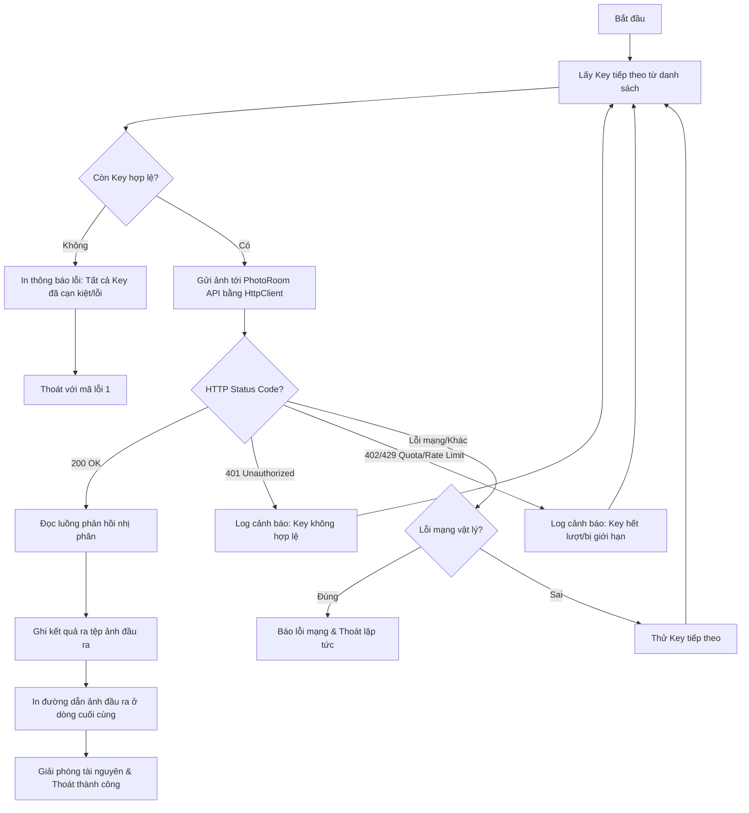

# Thiết kế Chi tiết Phase 2 — Thực hiện tách nền & Xoay tua API Key

Tài liệu này mô tả chi tiết thiết kế kỹ thuật, thuật toán xoay tua API Key, quản lý tài nguyên và xử lý các lỗi biên trong Phase 2 của dự án `remove-bg`.

## 1. Kiến trúc & Giải pháp kỹ thuật

Chúng ta sử dụng lớp `.NET HttpClient` có sẵn trong môi trường Windows PowerShell để thực hiện gửi yêu cầu `POST` tới PhotoRoom API.

### Thành phần chính:
- **`System.Net.Http.HttpClient`**: Client gửi HTTP Request. Cấu hình Timeout = 45 giây.
- **`System.Net.Http.MultipartFormDataContent`**: Dựng payload `multipart/form-data`.
- **`System.Net.Http.StreamContent`**: Chuyển luồng đọc file ảnh nhị phân thành content để upload.
- **`System.IO.FileStream`**: Đọc file ảnh nguồn một cách an toàn và giải phóng ngay sau khi dùng.

---

## 2. Lưu đồ xử lý & Thuật toán Xoay tua (Key Rotation)

Khi nhận được ảnh đầu vào, script thực hiện tuần tự qua danh sách các API Keys thu thập được:



---

## 3. Quản lý Tài nguyên & Edge Cases

### Giải phóng bộ nhớ (Dispose):
- Mọi đối tượng `.NET` (`HttpClient`, `MultipartFormDataContent`, `StreamContent`, `FileStream`, `HttpResponseMessage`) bắt buộc phải được đóng bằng phương thức `.Dispose()` trong khối `finally` của `try-catch` để tránh khóa tệp (file locking) hoặc rò rỉ RAM khi AI Agent chạy lặp lại nhiều lần.

### Phân biệt lỗi:
1. **Lỗi Key (401, 402, 429)**: Xoay sang key tiếp theo.
2. **Lỗi mạng (Không phân giải được DNS, mất mạng)**: Quăng lỗi và dừng script ngay lập tức để AI Agent nhận biết vấn đề hệ thống của máy chủ chạy tool, thay vì xoay tua vô ích toàn bộ các key.

---

## 4. Cách thức chạy thử nghiệm (Verification)

Sau khi hoàn thành code, ta có thể kiểm thử bằng cách:
1. Chạy với API Key hợp lệ (sandbox key của PhotoRoom):
   ```powershell
   powershell -ExecutionPolicy Bypass -File .\remove-bg.ps1 -InputPath .\test.jpg
   ```
2. Chạy với API Key sai để kiểm tra cơ chế xoay tua và lỗi cạn kiệt key:
   ```powershell
   powershell -ExecutionPolicy Bypass -File .\remove-bg.ps1 -InputPath .\test.jpg -ApiKey "invalid_key_123"
   ```
