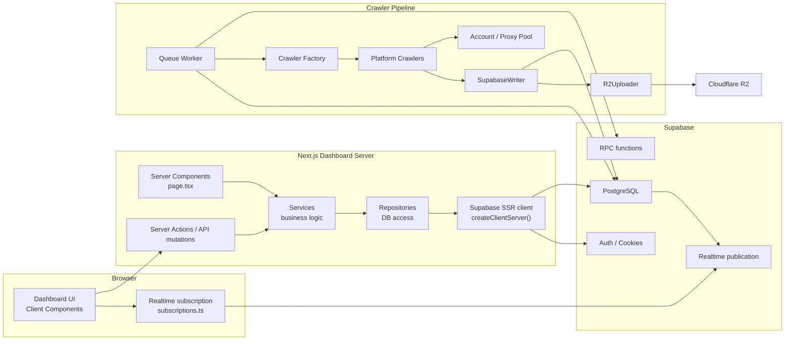
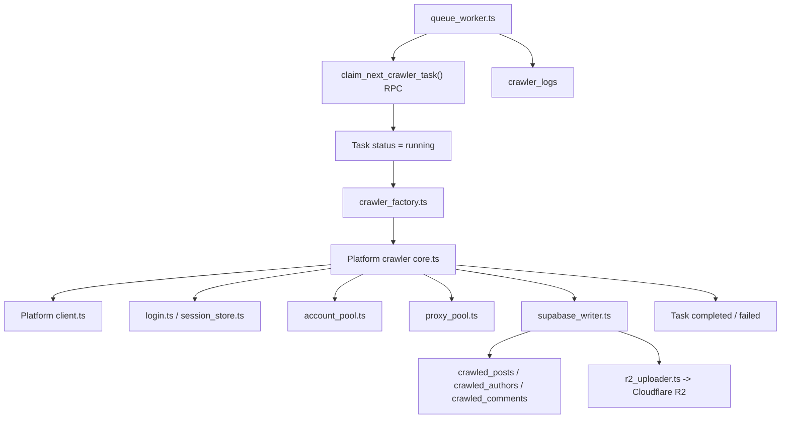

# SinoMedia Unified Architecture

Trạng thái: **Accepted / Locked**  
Ngày khóa: **2026-07-07**  
Phạm vi: `dashboard`, `crawler-pipeline`, `supabase`, external media embeds/original URLs, optional Cloudflare R2.

Tài liệu này là **source of truth kiến trúc** cho SinoMedia. Nếu tài liệu cũ còn nhắc Expo template, client-side Supabase trực tiếp, `api.ts` monolith hoặc mock fallback, thì coi đó là ngữ cảnh lịch sử, không phải kiến trúc chuẩn hiện tại.

> Trạng thái triển khai theo thời gian thực nằm ở `docs/project-status.md`. Tài liệu này khóa boundary kiến trúc; không dùng nó để suy luận rằng mọi trang/tính năng đã hoàn thiện.

## 1. Tóm tắt quyết định

SinoMedia là hệ thống crawl, chuẩn hóa, lưu trữ và phân tích nội dung từ các nền tảng mạng xã hội/short-video Trung Quốc.

Các khối chính:

- **Dashboard**: Next.js 16 App Router, dùng để quản trị crawler, xem dữ liệu, Creative Hub, task/log/account/proxy/audit.
- **Crawler Pipeline**: TypeScript worker độc lập, nhận task từ Supabase, crawl từng platform, ghi dữ liệu chuẩn hóa vào Supabase, lưu external media identifiers/URLs và chỉ upload R2 khi cần archive/cache.
- **Supabase**: PostgreSQL + Auth + PostgREST + Realtime + RPC, là control plane và data store chính.
- **Cloudflare R2**: object storage tùy chọn cho media cần archive/cache. Không còn là điều kiện bắt buộc để phát Bilibili trên Dashboard.
- **Desktop App**: Desktop Runtime Package đóng gói Dashboard và Worker thành ứng dụng độc lập; tương lai có thể điều phối local/remote worker và video downloader service, nhưng không nhúng crawler nặng vào UI process. Pake đã bị loại bỏ.

Quyết định khóa:

1. Dashboard đọc dữ liệu theo đường **Server Component → Service → Repository → `createClientServer()` → Supabase**.
2. Browser Supabase client chỉ dùng cho **Realtime WebSocket**, qua `dashboard/lib/realtime/subscriptions.ts`.
3. Crawler giao tiếp database bằng worker/store layer, không đi qua Dashboard.
4. Repository là lớp duy nhất trong Dashboard được chạm bảng Supabase.
5. Service là lớp duy nhất map raw DB row sang domain/UI model.
6. API routes không phải data-access mặc định; chỉ dùng cho mutation, webhook, export/download, hoặc compatibility tạm thời.
7. Không dùng mock fallback để che lỗi DB trong production path.
8. Legacy platform tables trong remote schema được giữ để tham chiếu/migration; Dashboard mới dùng bảng chuẩn hóa.
9. Desktop app là control surface. Nếu cần crawl/download trên máy người dùng, chạy worker/downloader như process/service riêng được điều phối qua Supabase.
10. Platform có official embedded player, trước mắt là Bilibili, ưu tiên lưu identifier/link gốc và render iframe thay vì tải video về R2 mặc định.

## 2. Context đã quan sát

Nguồn quan sát:

- GitNexus repo `SinoMedia`, index 2026-07-07:
  - 281 files
  - 2,883 symbols
  - 6,688 edges
  - 236 execution flows
- Các symbol/flow trung tâm:
  - `createClientServer` tại `dashboard/lib/supabase/server.ts`
  - `createClientBrowser` tại `dashboard/lib/supabase/client.ts`
  - `subscribeToTasks`, `subscribeToTaskLogs` tại `dashboard/lib/realtime/subscriptions.ts`
  - `PostRepository`, `TaskRepository`, `LogRepository`
  - `searchAds`, `getDashboardMetrics`, `getTasks`
  - `startQueueWorker`, `claimNextTask`, `writeLogToDb`
  - `SupabaseWriter`, `R2Uploader`, `checkoutAccount`

Tài liệu liên quan:

- `docs/project-status.md`
- `docs/roadmap.md`
- `docs/agent-handbook.md`
- `docs/architecture/embedded-iframe-player-strategy.md`
- `docs/architecture/crawler-hybrid-architecture.md`
- `docs/architecture/client-storage-strategy.md`
- `docs/decisions.md`
- `supabase/migrations/*`

## 3. Sơ đồ tổng thể



## 4. Repository layout chuẩn

```text
SinoMedia/
├─ dashboard/
│  ├─ app/
│  │  ├─ (auth)/                       # login/sign-up/forgot password
│  │  ├─ (main)/dash/                  # dashboard pages
│  │  └─ api/                          # route handlers, ưu tiên mutation/compat only
│  ├─ components/                      # shared UI
│  ├─ lib/
│  │  ├─ actions/                      # server actions callable từ client
│  │  ├─ repositories/                 # lớp duy nhất chạm DB tables
│  │  ├─ services/                     # business logic + mapping
│  │  ├─ realtime/subscriptions.ts     # nơi duy nhất dùng browser Supabase client
│  │  ├─ supabase/
│  │  │  ├─ server.ts                  # createClientServer()
│  │  │  ├─ client.ts                  # createClientBrowser(), realtime only
│  │  │  └─ middleware.ts              # refresh session cookie
│  │  ├─ stores/                       # Zustand UI state
│  │  └─ utils/                        # helpers
│  └─ types/                           # domain + generated Supabase types
├─ crawler-pipeline/
│  ├─ src/
│  │  ├─ base/                         # crawler/client/store/login contracts
│  │  ├─ cli/                          # command parser
│  │  ├─ config/                       # base + per-platform configs
│  │  ├─ crawl/                        # platform implementations
│  │  ├─ model/                        # platform + storage types
│  │  ├─ proxy/                        # proxy pool
│  │  ├─ sign/                         # signing/session/browser helpers
│  │  ├─ store/                        # Supabase + R2 writers
│  │  ├─ queue_worker.ts               # task claim/run/log loop
│  │  └─ index.ts                      # crawler entry
│  └─ tests/                           # platform test cases
├─ supabase/
│  ├─ migrations/                      # schema/RPC/realtime/indexes
│  └─ config.toml
└─ docs/
   └─ architecture/                    # source-of-truth architecture docs
```

## 5. Dashboard architecture

### 5.1 Data access boundary

Đường đọc dữ liệu chuẩn:

```text
Browser GET /dash/...
  -> Next.js render Server Component
    -> service function
      -> repository method
        -> createClientServer()
          -> Supabase PostgREST
```

Đường ghi dữ liệu chuẩn:

```text
Client Component event
  -> Server Action hoặc API Route POST/PUT/DELETE
    -> service function
      -> repository method / RPC
        -> Supabase
```

Đường realtime chuẩn:

```text
Client Component mount
  -> subscribeToTasks() / subscribeToTaskLogs()
    -> createClientBrowser()
      -> Supabase Realtime WebSocket
```

Luật import:

| Module | Được import | Không được import |
|---|---|---|
| Server `page.tsx` | services, server-safe components | repositories trực tiếp, browser Supabase client |
| Client Component | server actions, realtime subscriptions, UI utils | repositories, `createClientServer`, raw DB query |
| Services | repositories, domain types, `createClientServer` | React/UI state |
| Repositories | Supabase server client type, generated DB types | UI/domain mapper phức tạp |
| Realtime | `createClientBrowser` | CRUD query business logic |

### 5.2 Services

| Service | Vai trò | Repositories |
|---|---|---|
| `dashboard.service.ts` | Metrics, platform distribution, health cards | post, author, task, account |
| `data.service.ts` | Posts/authors/comments data pages | post, author, comment |
| `creative.service.ts` | Creative Hub search/trending/new/growth/advertisers/detail | post, author |
| `crawler.service.ts` | Tasks, task logs, accounts | task, log, account |
| `system.service.ts` | Proxies, audit logs, exports/settings support | proxy, audit |
| `auth.service.ts` | Supabase auth orchestration | Supabase server client |

### 5.3 Repositories

| Repository | Table chính |
|---|---|
| `post.repo.ts` | `crawled_posts` |
| `author.repo.ts` | `crawled_authors` |
| `comment.repo.ts` | `crawled_comments` |
| `task.repo.ts` | `crawler_tasks`, RPC `create_crawler_tasks` |
| `log.repo.ts` | `crawler_logs` |
| `account.repo.ts` | `crawler_accounts` |
| `proxy.repo.ts` | `crawler_proxies`, `crawler_accounts` |
| `audit.repo.ts` | `audit_logs`, `exported_files` |

Repository layer phải dùng generated types từ `dashboard/types/supabase.ts`. Không dùng `any` ở constructor hoặc public return type.

### 5.4 Page ownership

| Route | Owner service | Ghi chú kiến trúc |
|---|---|---|
| `/dash/home` | `dashboard.service` | Server read metrics; client chỉ render interaction nếu cần |
| `/dash/data/posts` | `data.service` | Server read list; comments/detail lazy nếu cần |
| `/dash/data/authors` | `data.service` | Server read list |
| `/dash/data/management` | `data.service` | Server read/export/filter |
| `/dash/creative/search` | `creative.service` | Server read initial data; client filter sync qua URL |
| `/dash/creative/new` | `creative.service` | Server read initial data |
| `/dash/creative/trending` | `creative.service` | Server read trending |
| `/dash/creative/growth` | `creative.service` | Server read growth; growth thật cần history table sau |
| `/dash/creative/advertisers` | `creative.service` | Server read advertisers |
| `/dash/creative/advertisers/[id]` | `creative.service` | Server read advertiser + ads |
| `/dash/creative/[id]` | `creative.service` | Server read detail; client media player allowed |
| `/dash/tasks` | `crawler.service` + realtime | Server initial read, realtime updates in client island |
| `/dash/accounts` | `crawler.service` | Server read; actions mutate |
| `/dash/proxies` | `system.service` | Server read; actions mutate |
| `/dash/audit-logs` | `system.service` | Server read |
| `/dash/settings` | local UI/settings service | Local-only settings rõ ràng, không giả là DB nếu chưa persist |

## 6. Crawler Pipeline architecture

Crawler Pipeline là process TypeScript độc lập, không phụ thuộc lifecycle của Dashboard.



### 6.1 Platform modules

Mỗi platform nằm trong `crawler-pipeline/src/crawl/<platform>/` và nên giữ contract:

```text
client.ts      # HTTP/API client, request signing, cookies
core.ts        # orchestrator crawl/search/creator/comments
field.ts       # platform field constants/mapping
login.ts       # QR/cookie/session login
extractor.ts   # parsing/extraction nếu platform cần
index.ts       # export boundary
```

Platforms hiện có:

- `bilibili`
- `douyin`
- `kuaishou`
- `tieba`
- `weibo`
- `xhs`
- `zhihu`

> **Douyin session boundary (2026-07-13):** Douyin vẫn đi theo hướng HTTP API crawler, nhưng raw cookie không còn được xem là session hoàn chỉnh. Worker có thể dùng Playwright Chromium persistent context như bước bootstrap/hydrator để xuất enriched `DouyinSession`, sau đó phải pass diagnostic hard gate trước khi HTTP API crawler chạy. Browser bootstrap không được biến thành crawler runtime mặc định.

### 6.2 Queue worker contract

Worker flow:

1. Claim task pending bằng RPC `claim_next_crawler_task()`.
2. Ghi log bắt đầu vào `crawler_logs`.
3. Dựng crawler theo `platform` + `command`.
4. Checkout account/proxy phù hợp.
5. Crawl dữ liệu và normalize sang storage model.
6. Lưu media identifier/link gốc; upload media lên R2 chỉ khi task/strategy yêu cầu archive/cache.
7. Upsert dữ liệu vào Supabase.
8. Cập nhật task `completed` hoặc `failed`.
9. Realtime publication đẩy task/log update về Dashboard.

Dashboard không gọi trực tiếp crawler function trong cùng process. Dashboard chỉ tạo task và quan sát trạng thái.

> **Quy tắc Kiến trúc (Media Playback)**: Creative detail không được phép tạo task cache media. Với platform có official embedded player như Bilibili, UI render iframe từ identifier/link gốc. Với direct media URL, URL phải được crawler/backfill chuẩn bị trước khi UI render. Việc bấm nút play chỉ thực hiện GET/embed media qua browser, không tạo task mới.

## 6.5 Desktop app, local worker và video downloader

Desktop app hiện tại không thay đổi boundary của hệ thống. Nó là lớp đóng gói/điều khiển, không phải nơi chạy logic crawl trong React/Next request lifecycle.

Định hướng:

```text
Desktop App (Runtime Package)
  -> Dashboard local/remote
  -> Supabase control plane
  -> local crawler worker / remote crawler worker
  -> video downloader worker
```

Quy tắc:

- Desktop Runtime Package là hướng packaging mặc định ở giai đoạn đầu.
- Pake đã bị loại bỏ. Electron chỉ là phương án fallback nếu cần native capability mà shell không đáp ứng.
- Local worker phải chạy như process/service riêng, dùng cùng contract với worker VPS: claim task, ghi log, update status.
- Video downloader service phải tách khỏi crawler chính nếu download lớn hoặc cần tải về local folder.
- Với Bilibili, desktop/dashboard chỉ cần BVID/canonical URL để mở nguồn hoặc render iframe; tải binary thật là việc của downloader service sau này nếu user chủ động cần.
- Dashboard/Desktop chỉ bật/tắt/cấu hình/quan sát worker; không import trực tiếp crawler core vào UI component.
- Secrets Supabase/R2/cookie/account không lưu trong localStorage browser.

Các thành phần chưa hoàn thiện phải được đánh dấu trong `docs/project-status.md`, không được ghi như tính năng Done.

## 7. Database và storage contracts

### 7.1 Bảng chuẩn hóa chính

| Table | Vai trò |
|---|---|
| `crawled_posts` | Nội dung/bài viết/video đã crawl, normalized |
| `crawled_authors` | Tác giả/creator normalized |
| `crawled_comments` | Comments/sub-comments normalized |
| `crawler_tasks` | Task queue control plane |
| `crawler_logs` | Logs theo task |
| `crawler_accounts` | Account pool |
| `crawler_proxies` | Proxy pool và assignment |
| `audit_logs` | Audit hành động dashboard/system |
| `exported_files` | Metadata file export |
| `creative_ads` | Creative-specific projection/analytics nếu cần |
| `creative_advertisers` | Advertiser projection nếu cần |

### 7.2 Legacy/raw platform tables

Remote schema còn nhiều bảng raw như `douyin_aweme`, `xhs_note`, `weibo_note`, `bilibili_video`, `kuaishou_video`, `tieba_note`, `zhihu_content` và các bảng comment/creator tương ứng.

Chúng không phải contract chính của Dashboard mới. Nếu cần dùng dữ liệu raw, phải đi qua migration/projection sang bảng chuẩn hóa hoặc repository riêng được ghi rõ.

### 7.3 RPC

| RPC | Consumer | Vai trò |
|---|---|---|
| `claim_next_crawler_task()` | queue worker | Atomic claim task pending/scheduled |
| `create_crawler_tasks(p_tasks)` | Dashboard service/repository | Bulk create tasks, dedup, trả inserted/skipped/errors |

### 7.4 Realtime

Realtime publication bật cho:

- `public.crawler_tasks`
- `public.crawler_logs`

Browser chỉ subscribe qua:

- `subscribeToTasks`
- `subscribeToTaskLogs`

Không mở realtime bừa bãi cho bảng dữ liệu lớn như `crawled_posts` nếu chưa có use case rõ và filter chặt.

### 7.5 External media embeds và original URLs

Với platform có official embedded player, Dashboard ưu tiên embed thay vì tự phát direct CDN URL.

Luật cho Bilibili:

- Crawler phải lưu BVID trong `platform_uid`.
- Crawler nên lưu canonical URL dạng `https://www.bilibili.com/video/<BVID>`.
- Dashboard build iframe từ `https://player.bilibili.com/player.html?bvid=<BVID>`.
- `media_urls` không cần là direct CDN video URL để playback Bilibili hoạt động.
- Nút tải/mở nguồn dùng canonical URL nếu chưa có downloader service thật.

Chi tiết nằm ở `docs/architecture/embedded-iframe-player-strategy.md`.

### 7.6 Cloudflare R2

R2 là nơi lưu media binary/object khi cần archive/cache. Supabase lưu metadata/URL/reference.

Luật:

- Media upload/download lớn không đi qua Dashboard server nếu có thể tránh.
- Crawler dùng `r2_uploader.ts` để upload khi `upload_r2` hoặc archive flow được bật.
- Database chỉ lưu URL/path/checksum/metadata nếu cần.
- Không lưu blob media trực tiếp trong PostgreSQL.
- Không dùng R2 như điều kiện bắt buộc cho Bilibili playback.

## 8. Auth, session và client storage

Dashboard dùng `@supabase/ssr`:

- `dashboard/lib/supabase/server.ts`: server-side auth/session-aware client.
- `dashboard/lib/supabase/middleware.ts`: refresh session cookie.
- `dashboard/lib/supabase/client.ts`: browser client cho realtime only.

Auth token không lưu trong localStorage production path. Cookie httpOnly/SameSite là hướng chính.

POST/PUT/PATCH/DELETE từ browser phải có kiểm soát:

- kiểm tra Origin/Referer hoặc CSRF token tùy endpoint;
- không expose service role key ra browser;
- validate payload ở action/route boundary.

Zustand/localStorage/IndexedDB chỉ dùng cho UI preferences hoặc draft/input lớn:

- sidebar collapsed;
- theme;
- temporary form drafts;
- large paste input/proxy list trước khi submit.

Không dùng localStorage làm nguồn dữ liệu authoritative cho business data.

## 9. API route policy

API route không phải mặc định cho read path.

Được dùng khi:

- mutation từ Client Component;
- webhook/external callback;
- file export/download action;
- compatibility trong giai đoạn migrate, có comment rõ;
- endpoint cần HTTP boundary độc lập.

Không dùng khi:

- Server Component có thể gọi service trực tiếp;
- chỉ để vòng từ browser → API route → service cho GET list data;
- chỉ để che lỗi typing hoặc tránh tách client/server component.

Creative GET routes (`app/api/creative/*`) đã bị xóa hoàn toàn (2026-07-09) do không còn consumer và là lỗ hổng bảo mật (không có auth guard). Dashboard đã migrate sang Server Component gọi service trực tiếp.

## 10. Error handling và observability

Luật lỗi:

- Repository throw lỗi DB nguyên bản hoặc wrap bằng error có context.
- Service quyết định user-facing fallback/empty state.
- UI hiển thị empty/error state rõ ràng.
- Không fallback mock data âm thầm khi DB lỗi.
- Crawler luôn ghi `crawler_logs` khi start/success/fail và cập nhật `crawler_tasks.status`.

Log levels:

- `DEBUG`: chi tiết kỹ thuật, chỉ bật khi cần.
- `INFO`: lifecycle chính.
- `WARN`: retry, rate limit, thiếu dữ liệu không fatal.
- `ERROR`: task fail hoặc lỗi cần can thiệp.

## 11. Performance rules

Dashboard:

- Server-side read cho initial render.
- Pagination bắt buộc cho list lớn.
- Không preload detail/media cho toàn bộ list.
- Creative detail lazy-load theo modal/detail route.
- URL search params là nguồn sự thật cho filters có thể share/bookmark.
- Chỉ subscribe realtime cho task/log đang xem.

Database:

- Dùng index cho `crawled_posts.tags`, `published_at`, `crawled_at`, JSON stats sort fields đã có migration.
- Không query raw platform tables trực tiếp từ UI.
- Bulk task create dùng RPC thay vì insert loop từ browser.

Crawler:

- Dùng account/proxy pool để giảm rate limit.
- Retry có backoff, không loop vô hạn.
- Upload media song song có giới hạn concurrency.

## 12. Security rules

1. Service role key chỉ ở server/crawler environment.
2. Browser chỉ thấy anon key qua Supabase client dành cho Realtime.
3. RLS/policies là lớp phòng thủ, không thay thế server-side validation.
4. Secrets không commit vào repo.
5. Cookie auth không được migrate ngược về localStorage.
6. API mutation phải validate payload, platform, command, task metadata.
7. Logs không chứa password, cookie, token, QR session secret.
8. Server Actions phải có auth guard (`requireUser()` hoặc `requireAdmin()`) ở tầng action. Cấm re-export trần từ service.
9. Tất cả response phải có security headers: `X-Frame-Options: DENY`, `X-Content-Type-Options: nosniff`, `Referrer-Policy`, `Permissions-Policy`. Cấu hình qua `next.config.ts`.
10. Worker REST API chỉ export HTTP methods được dùng (GET, POST, PATCH). Không export PUT/DELETE/OPTIONS nếu không có scope mapping.

## 13. Architecture Decision Records

### ADR-001: Dashboard dùng Repository + Service Pattern

Status: **Accepted**

Context:

- Dashboard từng có nhiều đường data access song song: singleton Supabase client, API monolith, mock fallback, route handlers.
- Điều này làm lộ boundary, khó type-safe và khó debug DB lỗi.

Decision:

- Repository là lớp duy nhất chạm table.
- Service compose repository và map sang domain/UI models.
- Server Component gọi service trực tiếp.

Trade-off:

- Tốn thêm file/layer.
- Refactor ban đầu nhiều.

Rationale:

- Giảm coupling UI ↔ schema.
- Dễ type hóa, test, audit.
- Hợp với Next.js App Router/server data fetching.

### ADR-002: Browser Supabase client chỉ dùng Realtime

Status: **Accepted**

Context:

- Realtime cần browser WebSocket.
- CRUD từ browser làm lẫn auth/session/security boundary.

Decision:

- `createClientBrowser()` chỉ được import ở `dashboard/lib/realtime/subscriptions.ts`.
- CRUD đi qua server client.

Trade-off:

- Một số interactive page cần tách server/client rõ hơn.

Rationale:

- Dễ audit key exposure.
- Giữ cookie-based auth path cho read/write.

### ADR-003: Task Queue dùng Supabase RPC làm control plane

Status: **Accepted**

Context:

- Dashboard cần tạo task.
- Worker cần claim task an toàn, tránh hai worker xử lý cùng task.

Decision:

- Task lưu trong `crawler_tasks`.
- Claim bằng RPC `claim_next_crawler_task()`.
- Bulk create bằng RPC `create_crawler_tasks(p_tasks)`.

Trade-off:

- Logic queue nằm một phần trong DB function.

Rationale:

- Atomic, đơn giản, đủ cho scale hiện tại.
- Không cần thêm Redis/BullMQ khi chưa chứng minh nhu cầu.

Revisit trigger:

- Cần throughput cao, delayed jobs phức tạp, retry policy đa tầng, hoặc multi-region worker.

### ADR-004: Normalized crawled tables là contract Dashboard

Status: **Accepted**

Context:

- Remote schema có nhiều bảng platform-specific.
- Dashboard cần UI chung cho nhiều platform.

Decision:

- Dashboard đọc bảng chuẩn hóa `crawled_posts`, `crawled_authors`, `crawled_comments`.
- Raw tables chỉ là legacy/migration source.

Trade-off:

- Crawler phải map field platform về schema chung.

Rationale:

- UI/service đơn giản.
- Creative Hub query/index thống nhất.

### ADR-005: Media binary không lưu trong PostgreSQL; R2 là archive/cache tùy chọn

Status: **Accepted**

Context:

- Media có dung lượng lớn, bandwidth cao.
- PostgreSQL không phù hợp lưu blob.
- Một số platform, như Bilibili, có official embedded player nên không cần tải binary về R2 để playback.

Decision:

- Supabase lưu metadata, platform identifier, canonical/original URL và trạng thái media.
- Dashboard ưu tiên official embed/original URL khi platform hỗ trợ.
- Crawler/downloader chỉ upload media lên R2 khi task/flow yêu cầu archive/cache/offline/report.

Trade-off:

- Cần quản lý nhiều media strategy: embed, original URL, proxy/direct URL, R2 archive.
- Nếu user cần file thật, cần downloader worker riêng thay vì giả định Dashboard đã có binary.

Rationale:

- Chi phí egress tốt.
- Tách metadata và binary clean.
- Tránh tải/upload video không cần thiết cho platform đã có player chính thức.

### ADR-006: Client storage chỉ cho UI/draft, không cho business source of truth

Status: **Accepted**

Context:

- Dashboard cần lưu theme/sidebar/draft lớn.
- Auth token trong localStorage rủi ro XSS.

Decision:

- Auth dùng cookie qua `@supabase/ssr`.
- Zustand/localStorage dùng UI preferences.
- IndexedDB dùng draft/input lớn, có fallback.

Trade-off:

- Cần migration/versioning cho persisted UI store.

Rationale:

- An toàn hơn, ít hydration flicker hơn, không block main thread với payload lớn.

## 14. Deprecated / không còn là kiến trúc chuẩn

Các pattern sau không được dùng cho code mới:

- Dashboard page import Supabase singleton để CRUD.
- `lib/api.ts` monolith làm data access chính.
- `mock-data.ts` fallback khi DB lỗi.
- Client Component fetch `/api/creative/*` cho initial read data nếu Server Component có thể gọi service.
- Lưu auth token trong localStorage.
- UI đọc raw platform tables trực tiếp.
- Crawler và Dashboard chạy chung process.
- Thêm platform bằng copy-paste không qua `crawler_factory`/base contracts.

## 15. Refactor backlog còn lại

Theo dõi trạng thái sống ở `docs/project-status.md` và hướng đi ở `docs/roadmap.md`. Tóm tắt thứ tự ưu tiên:

1. Convert `dashboard/types/supabase.ts` sang UTF-8 để ESLint đọc được.
2. Tạo alias type `DbClient`, `TableRow`, `TableInsert`, `TableUpdate`.
3. Type hóa repositories, bỏ `constructor(private db: any)`.
4. Type hóa service mappers, đặc biệt `creative.service.ts` và `dashboard.service.ts`.
5. Tách creative pages thành Server Component + client island.
6. Deprecate/xóa creative GET API routes sau khi không còn caller.
7. Sửa React lint `set-state-in-effect`, `immutability`.
8. Chạy `tsc`, `lint`, `build`, smoke test các route chính.

## 16. Validation commands

Dashboard:

```powershell
cd D:\Python\SinoMedia\dashboard
npx.cmd tsc --noEmit
npm.cmd run lint
npm.cmd run build
```

Crawler:

```powershell
cd D:\Python\SinoMedia\crawler-pipeline
npx.cmd tsc --noEmit
npm.cmd test
```

GitNexus:

```powershell
cd D:\Python\SinoMedia
node .gitnexus\run.cjs analyze
```

Before refactor:

```text
impact({ repo: "SinoMedia", target: "<symbol>", direction: "upstream" })
detect_changes({ repo: "SinoMedia", scope: "all" })
```

Quick boundary audit:

```powershell
rg 'createClientBrowser|createClientServer|constructor\(private db: any\)|/api/creative|mock-data|@/lib/supabase' dashboard\app dashboard\lib dashboard\components
```

## 17. Definition of Done cho kiến trúc

Kiến trúc được coi là “khóa” khi:

- Tài liệu này là source of truth được cập nhật khi có ADR mới.
- Dashboard read path tuân thủ Server Component → Service → Repository.
- Browser Supabase client chỉ nằm trong realtime subscriptions.
- Repository/service layer type-safe, không dùng `any` ở public contracts.
- Crawler task lifecycle hoạt động qua Supabase RPC + Realtime.
- Không có mock fallback che lỗi DB trong production path.
- `tsc`, `lint`, `build` pass cho Dashboard.
- Worker smoke test pass cho ít nhất một platform và task lifecycle.

## 18. Khi nào được thay đổi kiến trúc này

Chỉ thay đổi khi có một trong các trigger:

- Scale task vượt khả năng Supabase RPC queue.
- Cần multi-worker scheduling phức tạp hơn.
- Cần realtime trên dữ liệu lớn với fanout cao.
- Cần phân quyền tenant/team phức tạp hơn RLS hiện tại.
- Cần export/report pipeline riêng.
- Cần tách service backend khỏi Next.js server vì workload vượt ngưỡng.

Mọi thay đổi phải có ADR mới trong `docs/architecture/` hoặc cập nhật mục ADR của tài liệu này, ghi rõ context, options, decision, trade-off và migration plan.

## 19. Addendum 2026-07-21 - Douyin challenge recovery boundary

Douyin anti-bot challenge handling extends the existing Douyin browser-bootstrap exception, but does not change the HTTP-first crawler architecture.

Boundary rules:

- Dashboard and Desktop remain control surfaces. They may configure 2Captcha/API strategy and show balance/status, but they do not solve platform challenges at runtime.
- `crawler-pipeline` owns runtime session recovery because it owns browser profile, proxy/account context, diagnostic, and task logs.
- Generic provider code belongs in `crawler-pipeline/src/challenge/`.
- Douyin challenge detection/recovery belongs in `crawler-pipeline/src/crawl/douyin/`.
- `http_client.ts` may classify response signals such as `verify_check`, but must not open a browser or call solver providers.
- `core.ts` or a future `DouyinSessionManager` may orchestrate diagnostic -> recovery -> diagnostic -> crawl, with bounded attempts.

The source-of-truth deep dive is `docs/architecture/douyin-session-recovery.md`.
